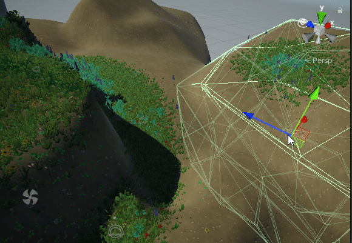
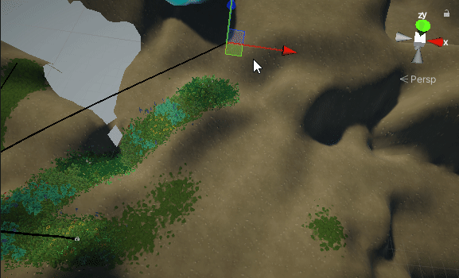
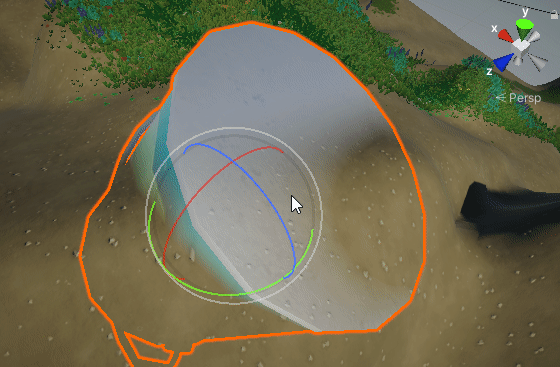

# Terrain Brush Tools

Some brush based tools that procedurally generate both a sealed mesh and texture mask for a terrain.

Everything's designed around the ability to move entire mountains around while keeping the mesh sealed and the texture fidelity maxed.

## Usage

For now the easiest way to get started is to create a TerrainBrushOverseer monobehavior with settings set up similar to the example scene.

Then you can use mesh brushes to easily alter terrain!


Various paint brushes can paint both terrain splats (R channel), and control grass density (G channel).


Using generated mesh maps, things like terrain blends are possible


Foliage and meshes can be saved to the scene to save loading time, but this can cost a HUGE amount of memory.

## Installation

Simply add `https://github.com/naelstrof/URPUnityTerrainTools.git#upm` as a package using the package manager.

Or if that doesn't work, add it to the manifest.json like so.

```
{
  "dependencies": {
    "com.vilarnaelstrof.terrainbrushtools": "https://github.com/naelstrof/URPUnityTerrainTools.git#upm",
  }
}
```
